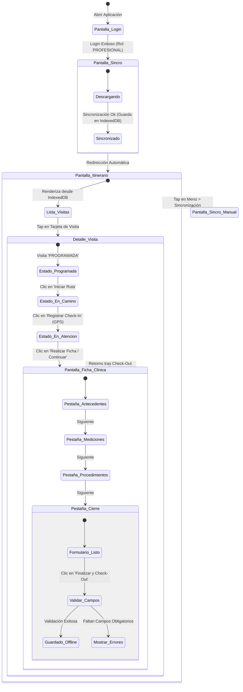

# Flujo de Navegación del Frontend (Mobile App / PWA)

Este documento describe el flujo exacto de pantallas, interacciones, botones y transiciones de estado de la aplicación móvil para el profesional de salud en terreno.

---

## 1. Diagrama de Flujo de Pantallas (Screen Flow)

El siguiente diagrama muestra cómo navega el profesional por la aplicación, indicando los disparadores (triggers) de cambio de pantalla y cómo influye el estado de la conexión.



---

## 2. Detalle de Pantallas e Interacciones (Paso a Paso)

### Pantalla 1: Login (Inicio de Sesión)
*   **Estado de Red**: Requerido en el primer inicio. En los siguientes inicios, si la sesión está guardada localmente (Token JWT / Secure Storage), salta directamente al Itinerario.
*   **UI/UX**:
    *   Formulario limpio con Email y Contraseña.
    *   Botón grande **"Ingresar"**.
*   **Acción**: Llama al servicio de autenticación. Si el rol del usuario en la base de datos es `PROFESIONAL`, inicia la descarga de datos.

---

### Pantalla 2: Sincronización Inicial (Matutina)
*   **Estado de Red**: Requerido.
*   **UI/UX**:
    *   Barra de progreso animada.
    *   Indicador de tareas:
        *   `[✓] Verificando credenciales...`
        *   `[✓] Descargando itinerario de hoy... (4 visitas encontradas)`
        *   `[✓] Descargando plantillas de fichas clínicas...`
        *   `[✓] Guardando base de datos local...`
*   **Transición**: Al completarse al 100%, la app se redirige automáticamente al **Itinerario**.

---

### Pantalla 3: Itinerario Diario (Lista de Visitas)
*   **Estado de Red**: **Funciona 100% Offline**.
*   **UI/UX**:
    *   **Header**: Muestra el nombre del profesional y un banner con el estado de conexión (`🟢 En Línea` o `🟡 Modo Offline`).
    *   **Lista vertical de Tarjetas**:
        *   Cada tarjeta representa una visita programada para el día.
        *   **Información clave en la tarjeta**:
            *   Hora programada (ej: `09:30 AM`).
            *   Prioridad con código de color: 🔴 Alta (Fragilidad/Reingreso), 🟡 Normal, 🔵 Baja.
            *   Nombre del paciente (ej: *Juan Pérez*).
            *   Comuna y dirección (ej: *Maipú - Av. Pajaritos 1234*).
            *   Estado actual (`PROGRAMADA`, `EN_CAMINO`, `EN_ATENCION`, `REALIZADA`).
*   **Acción del Usuario**: Tocar una tarjeta abre la **Pantalla 4 (Detalle de la Visita)**.

---

### Pantalla 4: Detalle de la Visita (Pre-Atención)
*   **Estado de Red**: **Funciona 100% Offline**.
*   **UI/UX**:
    *   Muestra la ficha de contacto del paciente (teléfono, cuidador, mapa offline simplificado o botón de enlace a Google Maps).
    *   **Botón de Control de Estados (Check-In)**: Este botón cambia dinámicamente según el estado actual de la visita:
        1.  **Si el estado es `PROGRAMADA`**:
            *   El botón dice: **"🚗 Iniciar Ruta hacia el Domicilio"**.
            *   Al hacer clic, registra la hora local, actualiza el estado a `EN_CAMINO` en IndexedDB y lo encola en la cola de sincronización.
        2.  **Si el estado es `EN_CAMINO`**:
            *   El botón dice: **"🚪 Registrar Check-In (Llegada)"**.
            *   Al hacer clic, la app solicita geolocalización GPS, guarda las coordenadas de llegada, la hora local, actualiza el estado a `EN_ATENCION` en IndexedDB y habilita el botón de la ficha clínica.
        3.  **Si el estado es `EN_ATENCION`**:
            *   Muestra un botón verde brillante: **"✏️ Realizar Ficha Clínica"**. Al presionarlo, lleva a la **Pantalla 5**.

---

### Pantalla 5: Ficha Clínica (Atención en Proceso)
*   **Estado de Red**: **Funciona 100% Offline**.
*   **UI/UX**: Un stepper o menú superior de 4 pestañas para facilitar el llenado rápido:

#### Pestaña 1: Antecedentes
*   Muestra el plan de cuidado actual del paciente (`planes_cuidado.objetivo_general`).
*   Historial simplificado (notas clínicas de las últimas 3 visitas para garantizar continuidad).

#### Pestaña 2: Signos Vitales (Mediciones)
*   Formulario con inputs numéricos para variables clínicas:
    *   *Presión Arterial (Sistólica / Diastólica)*.
    *   *Frecuencia Cardíaca (Latidos/min)*.
    *   *Temperatura (°C)*.
    *   *Saturación de Oxígeno (%)*.
*   **Lógica de validación**: Si la saturación ingresada es menor a `90%`, se muestra una advertencia en la pantalla: *"⚠️ Alerta: Saturación baja. Revise el estado del paciente."*

#### Pestaña 3: Procedimientos / Prestaciones
*   Lista de verificación (Checklist) con las prestaciones indicadas para esta visita (ej: `[ ] Curación simple`, `[ ] Administración de medicamento`).
*   El profesional marka lo realizado y puede añadir observaciones específicas por prestación.

#### Pestaña 4: Cierre y Check-Out
*   Caja de texto grande para "Observación Clínica General".
*   Botón para **"Adjuntar Foto"**: Abre la cámara del móvil, toma la foto, la comprime y la guarda localmente como una cadena de texto Base64 asociada a la ficha.
*   **Botón Finalizar y Check-Out**:
    *   Al hacer clic, el frontend ejecuta validaciones locales:
        1.  ¿Están llenos todos los campos requeridos?
        2.  ¿Se realizaron las prestaciones clave?
    *   Si pasa las validaciones, captura la coordenada GPS del Check-out, cambia el estado de la visita a `REALIZADA`, escribe los resultados en IndexedDB, encola la Ficha y el Check-out para sincronizarse y redirige a la **Pantalla 3 (Itinerario)**.

---

### Pantalla 6: Estado de la Cola de Sincronización
*   **Estado de Red**: Funciona Offline (muestra pendientes) y Online (procesa la cola).
*   **UI/UX**:
    *   Lista de registros pendientes de subirse al servidor (ej: *"Ficha de Juan Pérez - Pendiente"*, *"Check-in de María Gómez - Pendiente"*).
    *   Botón de **"Forzar Sincronización Manual"**.
    *   Indicador de almacenamiento: *"Espacio utilizado localmente: 1.2 MB / Fotos guardadas: 2"*.

---

## 3. Lógica del Validador Offline (Bloqueos en el Frontend)

Para garantizar la integridad de los datos clínicos, el botón **"Finalizar y Check-Out"** ejecuta el siguiente pseudocódigo en Javascript/React antes de guardar:

```javascript
function manejarFinalizacionVisita(visitaId, datosFicha) {
  // 1. Validar campos obligatorios de la plantilla
  const camposIncompletos = plantilla.campos.filter(campo => {
    return campo.obligatorio && !datosFicha[campo.codigo];
  });

  if (camposIncompletos.length > 0) {
    mostrarAlertaError("No puedes cerrar la atención. Faltan los siguientes campos obligatorios: " + 
      camposIncompletos.map(c => c.etiqueta).join(", ")
    );
    return; // Bloquea el flujo
  }

  // 2. Validar continuidad si el paciente es frágil
  if (paciente.es_fragil && !datosFicha.requiere_seguimiento) {
    mostrarAlertaAdvertencia("Este es un paciente frágil. ¿Confirmas que no requiere una segunda visita de seguimiento?");
    // Muestra un modal de confirmación. Si el usuario confirma, continúa; si no, bloquea.
  }

  // 3. Capturar Geolocalización GPS final
  navigator.geolocation.getCurrentPosition(
    (position) => {
      guardarEnColaSincronizacion(visitaId, {
        tipo: 'CHECK_OUT',
        latitud: position.coords.latitude,
        longitud: position.coords.longitude,
        datosFicha: datosFicha,
        timestamp: Date.now()
      });
      
      actualizarEstadoVisitaLocal(visitaId, 'REALIZADA');
      irAPantallaItinerario();
    },
    (error) => {
      // Si el GPS falla, igual permitimos guardar con una advertencia (offline safety)
      guardarEnColaSincronizacion(visitaId, {
        tipo: 'CHECK_OUT',
        latitud: null,
        longitud: null,
        observacion: "Fallo de GPS local: " + error.message,
        datosFicha: datosFicha,
        timestamp: Date.now()
      });
      actualizarEstadoVisitaLocal(visitaId, 'REALIZADA');
      irAPantallaItinerario();
    }
  );
}
```
